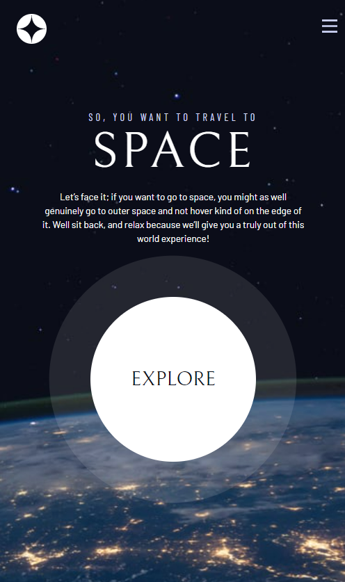
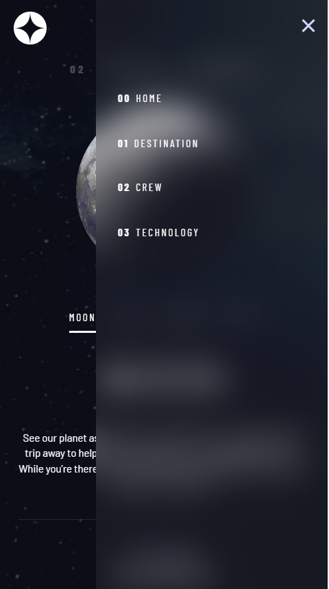

# Frontend Mentor - Space tourism website solution

This is a solution to the [Space tourism website challenge on Frontend Mentor](https://www.frontendmentor.io/challenges/space-tourism-multipage-website-gRWj1URZ3). Frontend Mentor challenges help you improve your coding skills by building realistic projects.

## Table of contents

- [Overview](#overview)
  - [The challenge](#the-challenge)
  - [Screenshot](#screenshot)
  - [Links](#links)
- [My process](#my-process)
  - [Built with](#built-with)
  - [What I learned](#what-i-learned)
  - [Continued development](#continued-development)
  - [Useful resources](#useful-resources)
- [Author](#author)
- [Acknowledgments](#acknowledgments)

**Note: Delete this note and update the table of contents based on what sections you keep.**

## Overview

### The challenge

Users should be able to:

- View the optimal layout for each of the website's pages depending on their device's screen size
- See hover states for all interactive elements on the page
- View each page and be able to toggle between the tabs to see new information

### Screenshot






### Links

- Solution URL: [Add solution URL here](https://github.com/stephenluketrainor/Space-tourism-website.git)
- Live Site URL: [Add live site URL here](XXXXXXXXXXXXXXXXXX)

## My process


### Built with

- Semantic HTML5 markup
- CSS custom properties
- CSS Utility classes
- CSS Design System
- CSS animations and transitions
- Attributes
- Flexbox
- CSS Grid
- JS with attributes
- Mobile-first workflow

### What I learned

I learned a lot in this challenge. The first thing that I learned was how to create a reset of my site by doing the following:
- Set all margins to 0.
- Create boxing sizing: border-box.
- Set all header fonts to be the same.
- Set images/pictures to be max-width:100% and block elements.
- Set up body default style.
- Make form elements easier to work with by inheriting the font styles.
- remove animations for screen-reader users.

The next major thing that I learned was how to use custom properties effectively. While this took a long time to set up, having plug-and-play custom properties allowed me to massively speed up work as I moved into sub-pages. The main custom properties that I set up were:
- fonts
- font-sizes
- colours
- margins
- flexbox/grid gaps
- margins for spacing in paragraphs (using the "flow" class to create great layouts for elements)

I learned how to create eye-catching animations using :after pseudo elements. This is something that I will need to practice quite a bit to fully get my head around it, but I have a great example on this site that I can use as a baseline.

Using semantic HTML to layout the website in a clear and understandable way for users, screen-readers and other coders.

Using tablists and tabs as roles to help with js integration and navigation for users.

Using media queries effectively to structure my site as a dynamic and responsive website.

Structuring the website using grid. This was a massive learning for me and has opened up a lot of doors in terms of styling possibilites and layout. I learned how to create responsive grids, tweak grid layouts depending on page content by using grid-layout.

I got much more familiar with css attributes. This is something that I knew little to none about before this challenge but is something that I have a high level of appreciation for now.

Mistakes I learned from

I forgot to add the google fonts to the homepage when starting.

I got mixed up with the media queries multiple times. Maybe it would be a good idea to make custom properties for these if that's possible.

adding defer to the js file at the top of the page allows the file to defer loading until the end of the body. Otherwise the js cannot read the whole page and won't function properly.


```html
<h1>     I am really happy with this HTML code for creating a navbar
  <button class="mobile-nav-toggle" aria-controls="primary-navigation"><span class="sr-only" aria-expanded="false">Menu</span></button>
    <nav>
        <ul id="primary-navigation" data-visible="false" class="primary-navigation underline-indicators flex">
            <li><a class="ff-sans-cond uppercase text-white letter-spacing-2" href="index.html"><span aria-hidden="true">00</span>Home</a>
            <li class="active"><a class="ff-sans-cond uppercase text-white letter-spacing-2" href="destination.html"><span aria-hidden="true">01</span>Destination</a>
            <li><a class="ff-sans-cond uppercase text-white letter-spacing-2" href="crew.html"><span aria-hidden="true">02</span>Crew</a>
            <li><a class="ff-sans-cond uppercase text-white letter-spacing-2" href="technology.html"><span aria-hidden="true">03</span>Technology</a>
        </ul>
    </nav>
</h1>
```
```css
.proud-of-this-css {
    --gap: clamp(1.5rem, 5vw, 3.5rem);
    --underline-gap: 2rem;
    list-style: none;
    padding: 0;
    margin: 0;
    background: hsl( var(--clr-white) / 0.05);
    backdrop-filter: blur(1.5rem);
  }

```
```js
const proudOfThisFunc = (e) => {
    // calling target of event which gets the element that fired the event
    const targetTab = e.target;
    const targetPanel = targetTab.getAttribute("aria-controls");
    // Hiding the underlining for each tab
    tabs.forEach((tab) => {tab.setAttribute("aria-selected",false);
    });
    // Showing underlining for selected tab
    targetTab.setAttribute("aria-selected",true);

  // Getting parent of tab that was clicked
    const tabContainer = targetTab.parentNode;
// Getting parent of tab system, which is the main
    const mainContainer = tabContainer.parentNode.parentNode;


    hideContent(mainContainer, '[role="tab-panel"]');
    hideContent(mainContainer, '[role="tab-picture"]');
    showContent(mainContainer, `#${targetPanel}`);
    showContent(mainContainer, `[data-tag=${targetPanel}]`);

    // -----------functions-------------
    // Hide all articles and images in document
    function hideContent(parent, content) {
      parent
        .querySelectorAll(content)
        .forEach((item) => item.setAttribute("hidden", true));
    }
// query select for the associated id of the tab that was clicked on using template literals. Everything in ${} is javascript
// Show articles and image associated with clicked tab
    function showContent(parent, content) {
      parent.querySelector(content).removeAttribute('hidden');
    }
}

}
```

### Continued development

CSS animations (using pseudo elements)
attributes in html + combining these with Javascript
custom properties + using custom properties for media queries
Using javascript to dynamically update page content rather than having multiple pages


### Useful resources


## Author

- Website - [Stephen Trainor](https://www.your-site.com)
- Frontend Mentor - [@yourusername](https://www.frontendmentor.io/profile/yourusername)
- Twitter - [@yourusername](https://www.twitter.com/yourusername)


## Acknowledgments

Thanks to Scrimba's Kevin Powell for significantly helping me with this project. I originally thought that I could do it on my own, but I have delighted to follow along in his lessons as he taught me some incredibly valuable knowledge and techniques for making a much better to read and functional website.
